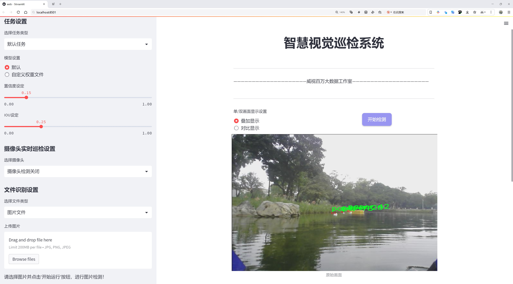
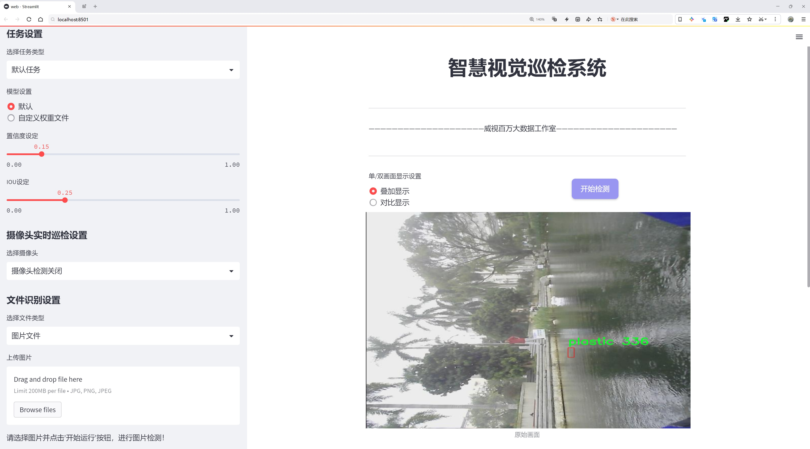
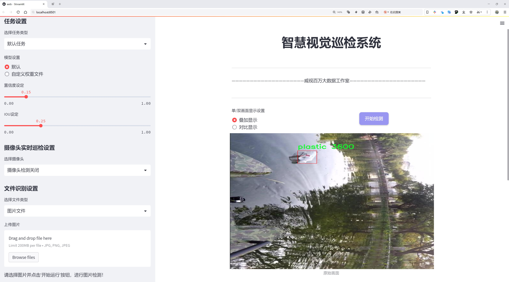
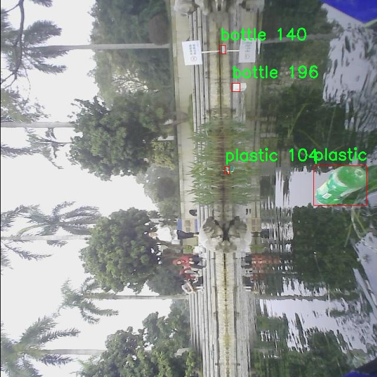
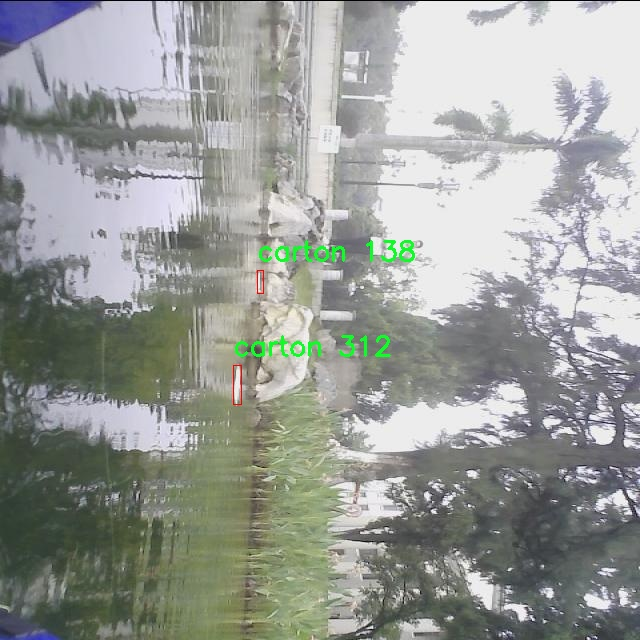
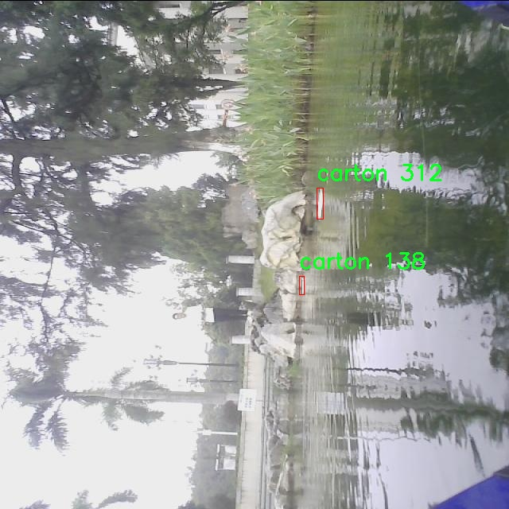
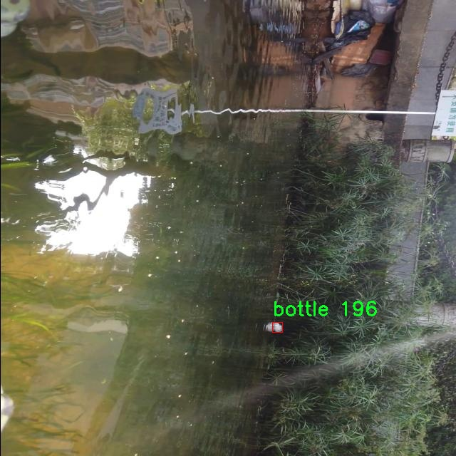
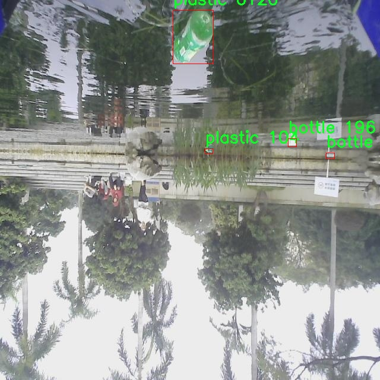

# 水面湖面垃圾分类检测检测系统源码分享
 # [一条龙教学YOLOV8标注好的数据集一键训练_70+全套改进创新点发刊_Web前端展示]

### 1.研究背景与意义

项目参考[AAAI Association for the Advancement of Artificial Intelligence](https://gitee.com/qunmasj/projects)

项目来源[AACV Association for the Advancement of Computer Vision](https://kdocs.cn/l/cszuIiCKVNis)

研究背景与意义

随着城市化进程的加快和人们生活水平的提高，水面和湖面垃圾问题日益严重，给生态环境和水资源安全带来了极大的威胁。水面垃圾不仅影响水体的美观，还对水生生物的生存和生态系统的平衡造成了负面影响。根据相关研究，水面垃圾的存在可能导致水质恶化，进而影响人类的饮水安全和健康。因此，及时、准确地识别和分类水面垃圾，成为了环境保护领域亟待解决的重要课题。

近年来，计算机视觉技术的快速发展为垃圾检测与分类提供了新的解决方案。YOLO（You Only Look Once）系列模型因其高效的实时检测能力，已被广泛应用于物体检测任务中。YOLOv8作为该系列的最新版本，具有更高的检测精度和更快的处理速度，适合在复杂环境中进行垃圾检测。然而，针对水面和湖面垃圾的检测任务，YOLOv8仍存在一些挑战，例如背景复杂性、光照变化以及垃圾种类的多样性等。因此，基于改进YOLOv8的水面湖面垃圾分类检测系统的研究，具有重要的理论价值和实践意义。

本研究的核心在于构建一个基于改进YOLOv8的垃圾分类检测系统，旨在提高水面和湖面垃圾的检测精度和分类效率。为此，我们将使用一个包含1800张图像的数据集，该数据集涵盖了四类垃圾：瓶子、纸箱、纸张和塑料。这些类别的选择不仅反映了水面垃圾的常见类型，也为模型的训练和评估提供了丰富的样本。通过对数据集的深入分析，我们将探索不同类别垃圾的特征和分布规律，以便为模型的改进提供依据。

在研究过程中，我们将针对YOLOv8模型进行一系列改进，包括优化网络结构、调整超参数、引入数据增强技术等，以提高模型在水面垃圾检测中的表现。此外，我们还将结合图像处理技术，提升图像的质量和可识别性，从而增强模型对复杂背景和光照变化的适应能力。通过这些改进，我们期望能够实现对水面垃圾的高效检测和准确分类，为后续的垃圾清理和环境保护工作提供技术支持。

综上所述，基于改进YOLOv8的水面湖面垃圾分类检测系统的研究，不仅有助于推动计算机视觉技术在环境保护领域的应用，也为水体生态环境的保护提供了新的思路和方法。通过实现高效的垃圾检测与分类，我们能够为水面垃圾的治理提供科学依据，促进可持续发展目标的实现。希望本研究能够为相关领域的研究者提供参考，推动水面垃圾治理技术的进步，最终实现水体环境的改善和生态系统的恢复。

### 2.图片演示







##### 注意：由于此博客编辑较早，上面“2.图片演示”和“3.视频演示”展示的系统图片或者视频可能为老版本，新版本在老版本的基础上升级如下：（实际效果以升级的新版本为准）

  （1）适配了YOLOV8的“目标检测”模型和“实例分割”模型，通过加载相应的权重（.pt）文件即可自适应加载模型。

  （2）支持“图片识别”、“视频识别”、“摄像头实时识别”三种识别模式。

  （3）支持“图片识别”、“视频识别”、“摄像头实时识别”三种识别结果保存导出，解决手动导出（容易卡顿出现爆内存）存在的问题，识别完自动保存结果并导出到tempDir中。

  （4）支持Web前端系统中的标题、背景图等自定义修改，后面提供修改教程。

  另外本项目提供训练的数据集和训练教程,暂不提供权重文件（best.pt）,需要您按照教程进行训练后实现图片演示和Web前端界面演示的效果。

### 3.视频演示

[3.1 视频演示](https://www.bilibili.com/video/BV15RxjehEbK/)

### 4.数据集信息展示

##### 4.1 本项目数据集详细数据（类别数＆类别名）

nc: 4
names: ['bottle', 'carton', 'paper', 'plastic']


##### 4.2 本项目数据集信息介绍

数据集信息展示

在本研究中，我们使用了名为“trash”的数据集，旨在训练和改进YOLOv8模型，以实现对水面和湖面垃圾的高效分类检测。该数据集专门针对水域环境中的常见垃圾类型进行了精心构建，涵盖了四个主要类别，分别是瓶子、纸箱、纸张和塑料。这些类别的选择不仅反映了水域垃圾的实际情况，也为模型的训练提供了丰富的样本和多样化的特征，从而提高了检测的准确性和鲁棒性。

“trash”数据集的设计考虑到了多种因素，以确保其在实际应用中的有效性。首先，数据集中的图像采集自不同的水域环境，包括湖泊、河流和人工水体，确保了数据的多样性和代表性。每个类别的样本均在不同的光照条件、天气状况和水面状态下进行拍摄，以模拟真实世界中可能遇到的各种场景。这种多样化的样本不仅有助于提高模型的泛化能力，还能增强其在复杂环境中的表现。

在数据标注方面，数据集采用了精确的标注方法，确保每个图像中的垃圾对象都被准确地框定和分类。标注过程中，专业人员对每个类别的特征进行了详细分析，以确保标注的准确性和一致性。这种高质量的标注不仅为模型的训练提供了可靠的基础，也为后续的模型评估和性能分析奠定了良好的基础。

此外，数据集的构建还充分考虑了数据的平衡性。每个类别的样本数量经过精心设计，以避免模型在训练过程中出现偏倚现象。通过确保每个类别的样本数量相对均衡，模型能够更好地学习到各类垃圾的特征，从而在实际应用中实现更高的分类精度。

在模型训练过程中，我们将“trash”数据集与YOLOv8模型相结合，利用其强大的特征提取能力和实时检测性能，进行了一系列实验。通过对数据集的深入分析和模型参数的优化，我们能够不断提升模型在水面垃圾分类检测任务中的表现。实验结果表明，经过训练的YOLOv8模型在对水面垃圾的检测和分类方面取得了显著的进展，能够有效识别出不同类型的垃圾，并在实时监测中表现出良好的稳定性和准确性。

总之，“trash”数据集为本研究提供了坚实的基础，凭借其丰富的样本、多样的环境和高质量的标注，极大地推动了水面湖面垃圾分类检测系统的开发与优化。未来，我们将继续探索数据集的扩展和改进，以进一步提升模型的性能，为水域环境保护和垃圾管理提供更为有效的技术支持。











### 5.全套项目环境部署视频教程（零基础手把手教学）

[5.1 环境部署教程链接（零基础手把手教学）](https://www.ixigua.com/7404473917358506534?logTag=c807d0cbc21c0ef59de5)


[5.2 安装Python虚拟环境创建和依赖库安装视频教程链接（零基础手把手教学）](https://www.ixigua.com/7404474678003106304?logTag=1f1041108cd1f708b01a)

### 6.手把手YOLOV8训练视频教程（零基础小白有手就能学会）

[6.1 手把手YOLOV8训练视频教程（零基础小白有手就能学会）](https://www.ixigua.com/7404477157818401292?logTag=d31a2dfd1983c9668658)

### 7.70+种全套YOLOV8创新点代码加载调参视频教程（一键加载写好的改进模型的配置文件）

[7.1 70+种全套YOLOV8创新点代码加载调参视频教程（一键加载写好的改进模型的配置文件）](https://www.ixigua.com/7404478314661806627?logTag=29066f8288e3f4eea3a4)

### 8.70+种全套YOLOV8创新点原理讲解（非科班也可以轻松写刊发刊，V10版本正在科研待更新）

由于篇幅限制，每个创新点的具体原理讲解就不一一展开，具体见下列网址中的创新点对应子项目的技术原理博客网址【Blog】：


[8.1 70+种全套YOLOV8创新点原理讲解链接](https://gitee.com/qunmasj/good)

### 9.系统功能展示（检测对象为举例，实际内容以本项目数据集为准）

图9.1.系统支持检测结果表格显示

  图9.2.系统支持置信度和IOU阈值手动调节

  图9.3.系统支持自定义加载权重文件best.pt(需要你通过步骤5中训练获得)

  图9.4.系统支持摄像头实时识别

  图9.5.系统支持图片识别

  图9.6.系统支持视频识别

  图9.7.系统支持识别结果文件自动保存

  图9.8.系统支持Excel导出检测结果数据


### 10.原始YOLOV8算法原理

原始YOLOv8算法原理

YOLOv8作为YOLO系列中的最新版本，继承并发展了前几代算法的核心思想，旨在实现更高效的目标检测。其设计理念基于深度学习的卷积神经网络（CNN），通过优化网络结构和算法流程，提升了目标检测的精度和速度。YOLOv8的基本架构由输入端、主干网络、Neck端和输出端四个模块组成，每个模块都在不同层面上进行了创新和改进，以适应现代计算机视觉的需求。

在输入端，YOLOv8采用了多种数据增强技术，如Mosaic数据增强、自适应图片缩放和灰度填充等，以提高模型对不同输入图像的适应能力。这些技术不仅增强了训练数据的多样性，还有效地提高了模型的鲁棒性，使其在面对复杂场景时依然能够保持较高的检测性能。

主干网络是YOLOv8的核心部分，其主要任务是从输入图像中提取特征。YOLOv8引入了C2F模块，取代了传统的C3模块，采用了更轻量化的3×3卷积，深度设置为3、6、6、3。这种设计显著降低了计算复杂度，同时保持了特征提取的有效性。通过使用C2F模块，YOLOv8能够更好地捕捉图像中的重要特征，尤其是在处理小目标时，能够有效减少信息损失。

在特征融合层，YOLOv8采用了特征金字塔网络（FPN）和路径聚合网络（PAN）的结合，进一步提升了对不同尺度特征的提取能力。特征金字塔网络通过构建多层次的特征图，使得模型能够在不同的尺度上进行特征融合，从而提高了对目标的检测精度。而路径聚合网络则通过上采样和下采样的结合，增强了特征图之间的信息流动，使得模型在处理复杂场景时能够更好地理解上下文信息。

YOLOv8的检测头层采用了轻量化的解耦头，取代了传统的耦合头结构。这一创新使得分类和回归过程得以分开处理，提升了模型的检测效率和准确性。在解耦头的设计中，YOLOv8引入了有错目标检测的方法，取代了无锚目标检测的方式，这一变化使得模型在复杂背景下的目标定位能力得到了显著提升。

YOLOv8的另一个重要创新是引入了BiFPN网络，这一结构通过高效的双向跨尺度连接和加权特征融合，进一步提高了模型对不同尺度特征信息的提取速度。BiFPN的设计理念是通过简化特征图之间的连接方式，减少冗余计算，从而加快特征融合的速度。这一改进使得YOLOv8在处理多尺度目标时表现得更加出色，尤其是在小目标检测方面，能够有效降低漏检率。

在损失函数的设计上，YOLOv8采用了TaskAlignedAssigner方法，对分类分数和回归分数进行加权匹配，确保模型在训练过程中能够更好地学习到目标的特征。分类损失使用了二元交叉熵（BCE），而回归损失则采用了分布焦点损失（DFL）和完全交并比（CIoU）损失函数。这些损失函数的设计使得YOLOv8在目标检测任务中能够更好地平衡精度和召回率，提高了模型的泛化能力。

尽管YOLOv8在许多方面都取得了显著的进展，但在复杂水面环境下的应用仍然面临挑战。小目标漂浮物的特征复杂且背景多样，导致YOLOv8在定位和感知能力上存在一定的不足。为了解决这些问题，研究者们提出了YOLOv8-WSSOD算法，通过引入BiFormer双层路由注意力机制，构建C2fBF模块，以捕获远程依赖，保留更细粒度的上下文信息。此外，针对小目标漏检问题，YOLOv8-WSSOD还添加了更小的检测头，并在Neck端引入GSConv和Slim-neck技术，以提高模型的检测精度和降低计算量。

综上所述，YOLOv8通过对网络结构的优化和算法流程的改进，展现了其在目标检测领域的强大能力。其轻量化设计和高效的特征提取能力，使得YOLOv8能够在各种复杂场景中实现快速、准确的目标检测。随着技术的不断进步，YOLOv8无疑将在智能监控、自动驾驶、人脸识别等多个应用领域发挥重要作用。


### 11.项目核心源码讲解（再也不用担心看不懂代码逻辑）

#### 11.1 70+种YOLOv8算法改进源码大全和调试加载训练教程（非必要）\ultralytics\models\nas\model.py

以下是对代码的核心部分进行的提炼和详细中文注释：

```python
# Ultralytics YOLO 🚀, AGPL-3.0 license
"""
YOLO-NAS模型接口。

示例：
    ```python
    from ultralytics import NAS

    model = NAS('yolo_nas_s')
    results = model.predict('ultralytics/assets/bus.jpg')
    ```
"""

from pathlib import Path
import torch
from ultralytics.engine.model import Model
from ultralytics.utils.torch_utils import model_info, smart_inference_mode
from .predict import NASPredictor
from .val import NASValidator

class NAS(Model):
    """
    YOLO NAS模型用于目标检测。

    该类提供YOLO-NAS模型的接口，并扩展了Ultralytics引擎中的`Model`类。
    它旨在简化使用预训练或自定义训练的YOLO-NAS模型进行目标检测的任务。

    属性：
        model (str): 预训练模型的路径或模型名称。默认为'yolo_nas_s.pt'。

    注意：
        YOLO-NAS模型仅支持预训练模型。请勿提供YAML配置文件。
    """

    def __init__(self, model='yolo_nas_s.pt') -> None:
        """使用提供的或默认的'yolo_nas_s.pt'模型初始化NAS模型。"""
        # 确保提供的模型文件不是YAML格式
        assert Path(model).suffix not in ('.yaml', '.yml'), 'YOLO-NAS模型仅支持预训练模型。'
        # 调用父类的初始化方法
        super().__init__(model, task='detect')

    @smart_inference_mode()
    def _load(self, weights: str, task: str):
        """加载现有的NAS模型权重，或如果未提供，则创建一个新的NAS模型并使用预训练权重。"""
        import super_gradients
        suffix = Path(weights).suffix
        # 根据权重文件的后缀加载模型
        if suffix == '.pt':
            self.model = torch.load(weights)  # 加载.pt文件
        elif suffix == '':
            self.model = super_gradients.training.models.get(weights, pretrained_weights='coco')  # 获取预训练模型

        # 标准化模型
        self.model.fuse = lambda verbose=True: self.model  # 定义融合方法
        self.model.stride = torch.tensor([32])  # 设置步幅
        self.model.names = dict(enumerate(self.model._class_names))  # 设置类别名称
        self.model.is_fused = lambda: False  # 返回模型是否已融合
        self.model.yaml = {}  # 初始化yaml属性
        self.model.pt_path = weights  # 设置权重路径
        self.model.task = 'detect'  # 设置任务类型

    def info(self, detailed=False, verbose=True):
        """
        记录模型信息。

        参数：
            detailed (bool): 是否显示模型的详细信息。
            verbose (bool): 控制输出的详细程度。
        """
        return model_info(self.model, detailed=detailed, verbose=verbose, imgsz=640)

    @property
    def task_map(self):
        """返回一个字典，将任务映射到相应的预测器和验证器类。"""
        return {'detect': {'predictor': NASPredictor, 'validator': NASValidator}}
```

### 代码核心部分分析：
1. **类定义**：`NAS`类继承自`Model`类，专门用于YOLO-NAS模型的目标检测任务。
2. **初始化方法**：`__init__`方法确保传入的模型文件是有效的，并调用父类的初始化方法。
3. **加载模型**：`_load`方法根据权重文件的后缀加载模型，支持`.pt`文件和无后缀的模型名称。
4. **模型信息**：`info`方法用于记录和输出模型的相关信息，便于用户了解模型的配置。
5. **任务映射**：`task_map`属性返回一个字典，指明了不同任务对应的预测器和验证器类，便于扩展和管理不同的任务。

这些核心部分构成了YOLO-NAS模型的基本功能，支持目标检测任务的实现。

该文件是YOLO-NAS模型的接口实现，属于Ultralytics YOLO系列的一个部分，主要用于目标检测任务。文件中首先导入了一些必要的库和模块，包括`Path`用于处理文件路径，`torch`用于深度学习框架PyTorch的操作，以及从Ultralytics引擎中导入的`Model`类和一些工具函数。

在文件的开头，有一个简短的文档字符串，说明了如何使用这个模型。用户可以通过导入`NAS`类并实例化一个模型对象来进行目标检测，示例代码展示了如何加载一个预训练的YOLO-NAS模型并对一张图片进行预测。

接下来定义了`NAS`类，该类继承自`Model`类，专门用于YOLO-NAS模型的实现。构造函数`__init__`接受一个参数`model`，默认值为'yolo_nas_s.pt'，并确保传入的模型路径不是以`.yaml`或`.yml`结尾，因为YOLO-NAS模型只支持预训练模型，而不支持配置文件。

`_load`方法用于加载模型权重。如果传入的权重文件是`.pt`格式，则直接加载该文件；如果没有后缀，则尝试从`super_gradients`库中获取预训练模型。该方法还对模型进行了一些标准化处理，包括设置模型的步幅、类别名称等属性。

`info`方法用于记录模型的信息，用户可以选择是否显示详细信息和控制输出的详细程度。

最后，`task_map`属性返回一个字典，将任务映射到相应的预测器和验证器类，便于在目标检测任务中使用。

整体来看，该文件提供了一个简洁的接口，方便用户使用YOLO-NAS模型进行目标检测，并且包含了必要的模型加载和信息查询功能。

#### 11.2 code\ultralytics\utils\instance.py

以下是代码中最核心的部分，并附上详细的中文注释：

```python
import numpy as np

class Bboxes:
    """
    处理边界框的类，支持多种边界框格式（如 'xyxy', 'xywh', 'ltwh'）。
    """

    def __init__(self, bboxes, format="xyxy") -> None:
        """
        初始化 Bboxes 类，接收边界框数据和格式。
        
        参数:
            bboxes (numpy.ndarray): 边界框数据，形状为 [N, 4]。
            format (str): 边界框格式，默认为 'xyxy'。
        """
        # 确保格式有效
        assert format in _formats, f"无效的边界框格式: {format}, 格式必须是 {_formats} 中的一种"
        # 如果 bboxes 是一维数组，则添加一个维度
        bboxes = bboxes[None, :] if bboxes.ndim == 1 else bboxes
        # 确保 bboxes 是二维数组，且每个边界框有 4 个坐标
        assert bboxes.ndim == 2
        assert bboxes.shape[1] == 4
        self.bboxes = bboxes  # 存储边界框
        self.format = format  # 存储边界框格式

    def convert(self, format):
        """
        将边界框格式从一种类型转换为另一种类型。
        
        参数:
            format (str): 目标格式，必须是 'xyxy', 'xywh', 'ltwh' 中的一种。
        """
        assert format in _formats, f"无效的边界框格式: {format}, 格式必须是 {_formats} 中的一种"
        if self.format == format:
            return  # 如果格式相同，不做任何操作
        # 根据当前格式和目标格式选择转换函数
        func = {
            "xyxy": xyxy2xywh if format == "xywh" else xyxy2ltwh,
            "xywh": xywh2xyxy if format == "xyxy" else xywh2ltwh,
            "ltwh": ltwh2xyxy if format == "xyxy" else ltwh2xywh
        }[self.format]
        self.bboxes = func(self.bboxes)  # 转换边界框
        self.format = format  # 更新格式

    def areas(self):
        """返回每个边界框的面积。"""
        self.convert("xyxy")  # 确保边界框格式为 'xyxy'
        # 计算面积：宽 * 高
        return (self.bboxes[:, 2] - self.bboxes[:, 0]) * (self.bboxes[:, 3] - self.bboxes[:, 1])

    def __len__(self):
        """返回边界框的数量。"""
        return len(self.bboxes)

class Instances:
    """
    存储图像中检测到的对象的边界框、分段和关键点的容器。
    """

    def __init__(self, bboxes, segments=None, keypoints=None, bbox_format="xywh", normalized=True) -> None:
        """
        初始化 Instances 类，接收边界框、分段和关键点数据。
        
        参数:
            bboxes (ndarray): 边界框数组，形状为 [N, 4]。
            segments (list | ndarray, optional): 对象分段，默认为 None。
            keypoints (ndarray, optional): 关键点数组，形状为 [N, 17, 3]，默认为 None。
            bbox_format (str, optional): 边界框格式，默认为 'xywh'。
            normalized (bool, optional): 边界框坐标是否经过归一化，默认为 True。
        """
        self._bboxes = Bboxes(bboxes=bboxes, format=bbox_format)  # 创建 Bboxes 对象
        self.keypoints = keypoints  # 存储关键点
        self.normalized = normalized  # 存储归一化标志
        self.segments = segments  # 存储分段

    def convert_bbox(self, format):
        """转换边界框格式。"""
        self._bboxes.convert(format=format)

    @property
    def bbox_areas(self):
        """计算边界框的面积。"""
        return self._bboxes.areas()

    def __getitem__(self, index) -> "Instances":
        """
        使用索引检索特定实例或一组实例。
        
        参数:
            index (int, slice, or np.ndarray): 索引、切片或布尔数组，用于选择所需的实例。
        
        返回:
            Instances: 包含所选边界框、分段和关键点的新 Instances 对象。
        """
        segments = self.segments[index] if len(self.segments) else self.segments
        keypoints = self.keypoints[index] if self.keypoints is not None else None
        bboxes = self._bboxes[index]
        bbox_format = self._bboxes.format
        return Instances(
            bboxes=bboxes,
            segments=segments,
            keypoints=keypoints,
            bbox_format=bbox_format,
            normalized=self.normalized,
        )
```

### 代码核心部分说明：
1. **Bboxes 类**：用于处理边界框的类，支持多种格式（`xyxy`, `xywh`, `ltwh`），并提供了格式转换、面积计算等功能。
2. **Instances 类**：用于存储图像中检测到的对象的边界框、分段和关键点，提供了格式转换和索引功能。

### 主要功能：
- **格式转换**：可以在不同的边界框格式之间进行转换。
- **面积计算**：可以计算每个边界框的面积。
- **实例管理**：可以通过索引获取特定的边界框实例。

这个程序文件定义了两个主要的类：`Bboxes`和`Instances`，用于处理计算机视觉中的边界框（bounding boxes）及其相关信息。文件开头引入了一些必要的库和函数，包括用于边界框格式转换的函数和类型注解。

`Bboxes`类用于管理边界框，支持多种格式（如`xyxy`、`xywh`和`ltwh`）。在初始化时，用户需要提供边界框数据和格式，程序会进行格式验证，并确保输入数据是二维的。该类提供了多种方法来转换边界框格式、计算面积、缩放、添加偏移等操作。`convert`方法可以将边界框从一种格式转换为另一种格式，`areas`方法计算每个边界框的面积。类中还定义了`mul`和`add`方法，分别用于按比例缩放和添加偏移量。

`Instances`类则是一个更高层次的容器，除了包含边界框外，还可以存储分割信息和关键点。初始化时，用户可以提供边界框、分割和关键点数据。该类提供了类似于`Bboxes`的功能，但也增加了处理分割和关键点的能力。它包含方法用于格式转换、缩放、归一化和去除零面积的边界框等。`scale`、`denormalize`和`normalize`方法分别用于缩放、去归一化和归一化边界框及其相关信息。

两个类都实现了索引功能，允许用户通过索引获取特定的边界框或实例。`Bboxes`类支持将多个`Bboxes`对象连接成一个，而`Instances`类则支持将多个`Instances`对象连接成一个，便于批量处理。

总的来说，这个文件提供了一套完整的工具，用于处理和操作计算机视觉中的边界框及其相关数据，方便后续的图像处理和分析。

#### 11.3 ui.py

以下是保留的核心代码部分，并添加了详细的中文注释：

```python
import sys
import subprocess

def run_script(script_path):
    """
    使用当前 Python 环境运行指定的脚本。

    Args:
        script_path (str): 要运行的脚本路径

    Returns:
        None
    """
    # 获取当前 Python 解释器的路径
    python_path = sys.executable

    # 构建运行命令，使用 streamlit 运行指定的脚本
    command = f'"{python_path}" -m streamlit run "{script_path}"'

    # 执行命令
    result = subprocess.run(command, shell=True)
    
    # 检查命令执行结果，如果返回码不为0，则表示运行出错
    if result.returncode != 0:
        print("脚本运行出错。")

# 实例化并运行应用
if __name__ == "__main__":
    # 指定要运行的脚本路径
    script_path = "web.py"  # 假设脚本在当前目录下

    # 调用函数运行脚本
    run_script(script_path)
```

### 代码注释说明：
1. **导入模块**：
   - `sys`：用于获取当前 Python 解释器的路径。
   - `subprocess`：用于执行外部命令。

2. **`run_script` 函数**：
   - 定义一个函数，用于运行指定路径的 Python 脚本。
   - 使用 `sys.executable` 获取当前 Python 解释器的路径，以确保脚本在正确的环境中运行。
   - 构建一个命令字符串，使用 `streamlit` 模块运行指定的脚本。
   - 使用 `subprocess.run` 执行命令，并通过 `shell=True` 允许在 shell 中执行。
   - 检查命令的返回码，如果不为0，表示执行出错，打印错误信息。

3. **主程序部分**：
   - 使用 `if __name__ == "__main__":` 确保只有在直接运行该脚本时才会执行以下代码。
   - 指定要运行的脚本路径（这里假设脚本在当前目录下）。
   - 调用 `run_script` 函数，传入脚本路径以执行该脚本。

这个程序文件名为 `ui.py`，其主要功能是通过当前的 Python 环境来运行一个指定的脚本，具体是使用 Streamlit 框架来启动一个 Web 应用。

首先，程序导入了几个必要的模块，包括 `sys`、`os` 和 `subprocess`。`sys` 模块用于访问与 Python 解释器紧密相关的变量和函数，`os` 模块提供了与操作系统交互的功能，而 `subprocess` 模块则用于创建新进程、连接到它们的输入/输出/错误管道，并获取它们的返回码。

接下来，程序从 `QtFusion.path` 模块中导入了 `abs_path` 函数，这个函数的作用是获取文件的绝对路径。

在 `run_script` 函数中，程序接收一个参数 `script_path`，表示要运行的脚本的路径。函数首先获取当前 Python 解释器的路径，并将其存储在 `python_path` 变量中。然后，构建一个命令字符串，使用 Streamlit 来运行指定的脚本。这个命令使用了 `-m` 选项来指定模块运行。

接着，程序通过 `subprocess.run` 方法执行构建好的命令。如果命令执行的返回码不为零，说明脚本运行过程中出现了错误，程序会输出“脚本运行出错。”的提示信息。

在文件的最后部分，程序通过 `if __name__ == "__main__":` 语句来判断是否是直接运行该脚本。如果是，程序会指定要运行的脚本路径，这里是 `web.py`，并调用 `run_script` 函数来执行这个脚本。

总体来说，这个程序的主要功能是为用户提供一个简单的接口，以便通过当前的 Python 环境来运行一个 Streamlit Web 应用脚本。

#### 11.4 code\ultralytics\models\fastsam\prompt.py

以下是代码中最核心的部分，并附上详细的中文注释：

```python
import os
import numpy as np
import torch
from PIL import Image
import cv2
from ultralytics.utils import TQDM

class FastSAMPrompt:
    """
    Fast Segment Anything Model类，用于图像标注和可视化。

    属性:
        device (str): 计算设备（'cuda'或'cpu'）。
        results: 目标检测或分割结果。
        source: 源图像或图像路径。
        clip: 用于线性分配的CLIP模型。
    """

    def __init__(self, source, results, device="cuda") -> None:
        """初始化FastSAMPrompt，设置源图像、结果和设备，并导入CLIP模型。"""
        self.device = device
        self.results = results
        self.source = source

        # 导入并分配CLIP模型
        try:
            import clip  # 用于线性分配
        except ImportError:
            from ultralytics.utils.checks import check_requirements
            check_requirements("git+https://github.com/openai/CLIP.git")
            import clip
        self.clip = clip

    @staticmethod
    def _format_results(result, filter=0):
        """将检测结果格式化为包含ID、分割、边界框、得分和面积的注释列表。"""
        annotations = []
        n = len(result.masks.data) if result.masks is not None else 0
        for i in range(n):
            mask = result.masks.data[i] == 1.0
            if torch.sum(mask) >= filter:
                annotation = {
                    "id": i,
                    "segmentation": mask.cpu().numpy(),
                    "bbox": result.boxes.data[i],
                    "score": result.boxes.conf[i],
                }
                annotation["area"] = annotation["segmentation"].sum()
                annotations.append(annotation)
        return annotations

    @torch.no_grad()
    def retrieve(self, model, preprocess, elements, search_text: str, device) -> int:
        """处理图像和文本，计算相似度，并返回softmax得分。"""
        preprocessed_images = [preprocess(image).to(device) for image in elements]
        tokenized_text = self.clip.tokenize([search_text]).to(device)
        stacked_images = torch.stack(preprocessed_images)
        image_features = model.encode_image(stacked_images)
        text_features = model.encode_text(tokenized_text)
        image_features /= image_features.norm(dim=-1, keepdim=True)
        text_features /= text_features.norm(dim=-1, keepdim=True)
        probs = 100.0 * image_features @ text_features.T
        return probs[:, 0].softmax(dim=0)

    def text_prompt(self, text):
        """处理文本提示，应用于现有结果并返回更新后的结果。"""
        if self.results[0].masks is not None:
            format_results = self._format_results(self.results[0], 0)
            cropped_boxes, cropped_images, not_crop, filter_id, annotations = self._crop_image(format_results)
            clip_model, preprocess = self.clip.load("ViT-B/32", device=self.device)
            scores = self.retrieve(clip_model, preprocess, cropped_boxes, text, device=self.device)
            max_idx = scores.argsort()[-1]  # 获取得分最高的索引
            max_idx += sum(np.array(filter_id) <= int(max_idx))  # 处理过滤的索引
            self.results[0].masks.data = torch.tensor(np.array([annotations[max_idx]["segmentation"]]))
        return self.results

    def everything_prompt(self):
        """返回类中先前方法处理后的结果。"""
        return self.results
```

### 代码核心部分说明：
1. **类的定义**：`FastSAMPrompt`类用于处理图像分割和标注任务，包含了设备选择、结果存储和CLIP模型的加载。
2. **初始化方法**：`__init__`方法负责初始化类的属性，并导入CLIP模型。
3. **结果格式化**：`_format_results`方法将检测结果格式化为包含必要信息的注释列表，便于后续处理。
4. **相似度计算**：`retrieve`方法通过CLIP模型计算图像和文本之间的相似度，并返回softmax得分，帮助选择最相关的分割结果。
5. **文本提示处理**：`text_prompt`方法接收文本输入，利用CLIP模型和之前格式化的结果更新分割结果。
6. **获取所有结果**：`everything_prompt`方法返回当前处理的结果，便于外部调用。

这些核心部分构成了图像分割和标注的基本框架，能够处理输入图像并根据用户的文本提示生成相应的分割结果。

这个程序文件定义了一个名为 `FastSAMPrompt` 的类，主要用于图像注释和可视化，特别是在图像分割和目标检测方面。该类的构造函数接受源图像、检测结果和计算设备（如 CUDA 或 CPU）作为参数，并尝试导入 CLIP 模型用于线性分配。

在类中，有多个静态方法和实例方法。静态方法包括 `_segment_image`、`_format_results`、`_get_bbox_from_mask` 等，用于处理图像分割、格式化检测结果和从掩码中获取边界框。这些方法帮助将输入图像根据给定的边界框进行分割，并将检测结果整理成包含 ID、分割掩码、边界框和置信度分数的注释列表。

`plot` 方法用于在图像上绘制注释、边界框和点，并将结果保存到指定的输出目录。该方法使用 `matplotlib` 进行可视化，并支持多种选项，如是否使用随机颜色、是否绘制轮廓等。

`fast_show_mask` 方法则用于快速显示掩码注释，支持随机颜色和透明度设置。该方法通过处理掩码数据，将其可视化到指定的 `matplotlib` 轴上。

类中还包含一些与文本和点提示相关的方法，如 `retrieve`、`box_prompt`、`point_prompt` 和 `text_prompt`。这些方法允许用户通过文本、点或边界框与模型交互，修改分割结果。例如，`box_prompt` 方法通过计算掩码与边界框之间的交并比（IoU）来调整掩码，而 `point_prompt` 方法则根据用户输入的点来修改掩码。

最后，`everything_prompt` 方法返回类中处理后的结果，方便用户获取最终的分割结果。

整体来看，这个类提供了一整套图像分割和注释的工具，结合了深度学习模型和用户交互，适用于需要高效图像处理和可视化的场景。

#### 11.5 train.py

以下是代码中最核心的部分，并附上详细的中文注释：

```python
class DetectionTrainer(BaseTrainer):
    """
    DetectionTrainer类用于基于检测模型进行训练，继承自BaseTrainer类。
    """

    def build_dataset(self, img_path, mode="train", batch=None):
        """
        构建YOLO数据集。

        参数:
            img_path (str): 包含图像的文件夹路径。
            mode (str): 模式，可以是'train'或'val'，用户可以为每种模式自定义不同的增强。
            batch (int, optional): 批次大小，仅在'rect'模式下使用。默认为None。
        """
        gs = max(int(de_parallel(self.model).stride.max() if self.model else 0), 32)
        return build_yolo_dataset(self.args, img_path, batch, self.data, mode=mode, rect=mode == "val", stride=gs)

    def get_dataloader(self, dataset_path, batch_size=16, rank=0, mode="train"):
        """构造并返回数据加载器。"""
        assert mode in ["train", "val"]  # 确保模式有效
        with torch_distributed_zero_first(rank):  # 仅在DDP情况下初始化数据集*.cache一次
            dataset = self.build_dataset(dataset_path, mode, batch_size)
        shuffle = mode == "train"  # 训练模式下打乱数据
        if getattr(dataset, "rect", False) and shuffle:
            LOGGER.warning("WARNING ⚠️ 'rect=True'与DataLoader的shuffle不兼容，设置shuffle=False")
            shuffle = False
        workers = self.args.workers if mode == "train" else self.args.workers * 2  # 设置工作线程数
        return build_dataloader(dataset, batch_size, workers, shuffle, rank)  # 返回数据加载器

    def preprocess_batch(self, batch):
        """对一批图像进行预处理，包括缩放和转换为浮点数。"""
        batch["img"] = batch["img"].to(self.device, non_blocking=True).float() / 255  # 将图像转换为浮点数并归一化
        if self.args.multi_scale:  # 如果启用多尺度
            imgs = batch["img"]
            sz = (
                random.randrange(self.args.imgsz * 0.5, self.args.imgsz * 1.5 + self.stride)
                // self.stride
                * self.stride
            )  # 随机选择图像大小
            sf = sz / max(imgs.shape[2:])  # 计算缩放因子
            if sf != 1:
                ns = [
                    math.ceil(x * sf / self.stride) * self.stride for x in imgs.shape[2:]
                ]  # 计算新的形状
                imgs = nn.functional.interpolate(imgs, size=ns, mode="bilinear", align_corners=False)  # 进行插值
            batch["img"] = imgs  # 更新图像
        return batch

    def set_model_attributes(self):
        """设置模型的属性，包括类别数量和名称。"""
        self.model.nc = self.data["nc"]  # 将类别数量附加到模型
        self.model.names = self.data["names"]  # 将类别名称附加到模型
        self.model.args = self.args  # 将超参数附加到模型

    def get_model(self, cfg=None, weights=None, verbose=True):
        """返回YOLO检测模型。"""
        model = DetectionModel(cfg, nc=self.data["nc"], verbose=verbose and RANK == -1)  # 创建检测模型
        if weights:
            model.load(weights)  # 加载权重
        return model

    def get_validator(self):
        """返回YOLO模型验证器。"""
        self.loss_names = "box_loss", "cls_loss", "dfl_loss"  # 定义损失名称
        return yolo.detect.DetectionValidator(
            self.test_loader, save_dir=self.save_dir, args=copy(self.args), _callbacks=self.callbacks
        )

    def plot_training_samples(self, batch, ni):
        """绘制带有注释的训练样本。"""
        plot_images(
            images=batch["img"],
            batch_idx=batch["batch_idx"],
            cls=batch["cls"].squeeze(-1),
            bboxes=batch["bboxes"],
            paths=batch["im_file"],
            fname=self.save_dir / f"train_batch{ni}.jpg",
            on_plot=self.on_plot,
        )

    def plot_metrics(self):
        """从CSV文件中绘制指标。"""
        plot_results(file=self.csv, on_plot=self.on_plot)  # 保存结果图

    def plot_training_labels(self):
        """创建YOLO模型的标记训练图。"""
        boxes = np.concatenate([lb["bboxes"] for lb in self.train_loader.dataset.labels], 0)  # 合并所有边界框
        cls = np.concatenate([lb["cls"] for lb in self.train_loader.dataset.labels], 0)  # 合并所有类别
        plot_labels(boxes, cls.squeeze(), names=self.data["names"], save_dir=self.save_dir, on_plot=self.on_plot)  # 绘制标签
```

### 代码核心部分说明：
1. **DetectionTrainer类**：用于管理YOLO模型的训练过程，包含数据集构建、数据加载、模型设置等功能。
2. **build_dataset**：根据输入路径和模式构建YOLO数据集。
3. **get_dataloader**：构建并返回数据加载器，支持分布式训练。
4. **preprocess_batch**：对输入的图像批次进行预处理，包括归一化和多尺度调整。
5. **set_model_attributes**：设置模型的类别数量和名称等属性。
6. **get_model**：返回YOLO检测模型，并可选择加载预训练权重。
7. **get_validator**：返回用于验证模型的验证器。
8. **plot_training_samples**、**plot_metrics**、**plot_training_labels**：用于可视化训练样本、训练指标和标签。

这个程序文件 `train.py` 是一个用于训练 YOLO（You Only Look Once）目标检测模型的实现，继承自 `BaseTrainer` 类。它主要包含了构建数据集、数据加载、预处理、模型设置、训练过程中的损失计算和可视化等功能。

首先，文件导入了一些必要的库和模块，包括数学运算、随机数生成、深度学习框架 PyTorch 相关的模块，以及 Ultralytics 提供的 YOLO 相关工具和函数。接着，定义了 `DetectionTrainer` 类，该类负责训练基于 YOLO 的目标检测模型。

在 `DetectionTrainer` 类中，`build_dataset` 方法用于构建 YOLO 数据集。它接收图像路径、模式（训练或验证）和批量大小作为参数，并根据模型的步幅计算合适的参数来构建数据集。

`get_dataloader` 方法用于创建数据加载器，确保在分布式训练时只初始化一次数据集。它会根据模式决定是否打乱数据，并根据训练或验证的需要设置工作线程数。

`preprocess_batch` 方法负责对输入的图像批次进行预处理，包括将图像缩放到合适的大小并转换为浮点数格式。该方法还支持多尺度训练，通过随机选择图像的大小来增强模型的鲁棒性。

`set_model_attributes` 方法用于设置模型的属性，包括类别数量和类别名称，以便模型能够正确处理数据。

`get_model` 方法返回一个 YOLO 检测模型实例，并可选择加载预训练权重。

`get_validator` 方法返回一个用于验证模型性能的 `DetectionValidator` 实例，能够在训练过程中评估模型的效果。

`label_loss_items` 方法用于返回带有标签的训练损失项字典，方便在训练过程中记录和监控损失。

`progress_string` 方法生成一个格式化的字符串，用于显示训练进度，包括当前的 epoch、GPU 内存使用情况、损失值、实例数量和图像大小等信息。

`plot_training_samples` 方法用于绘制训练样本及其标注，帮助可视化训练过程中的数据。

最后，`plot_metrics` 和 `plot_training_labels` 方法分别用于绘制训练过程中的指标和创建带标签的训练图，便于分析模型的训练效果。

整体而言，这个文件提供了一个完整的框架，支持 YOLO 模型的训练过程，包括数据处理、模型构建、训练监控和结果可视化等功能。

#### 11.6 val.py

以下是经过简化和注释的核心代码部分，主要保留了 YOLO 模型的验证逻辑及其相关功能：

```python
import os
import torch
from ultralytics.engine.validator import BaseValidator
from ultralytics.utils import LOGGER, ops
from ultralytics.utils.metrics import ConfusionMatrix, DetMetrics, box_iou

class DetectionValidator(BaseValidator):
    """
    继承自 BaseValidator 的检测模型验证类。
    用于验证 YOLO 模型的性能。
    """

    def __init__(self, dataloader=None, save_dir=None, args=None):
        """初始化检测模型所需的变量和设置。"""
        super().__init__(dataloader, save_dir, args)
        self.metrics = DetMetrics(save_dir=self.save_dir)  # 初始化检测指标
        self.confusion_matrix = ConfusionMatrix(nc=len(args.names), conf=args.conf)  # 初始化混淆矩阵

    def preprocess(self, batch):
        """预处理图像批次以适应 YOLO 模型。"""
        batch["img"] = batch["img"].to(self.device) / 255  # 将图像归一化
        for k in ["batch_idx", "cls", "bboxes"]:
            batch[k] = batch[k].to(self.device)  # 将标签和边界框移动到设备上
        return batch

    def postprocess(self, preds):
        """对预测结果应用非极大值抑制（NMS）。"""
        return ops.non_max_suppression(
            preds,
            self.args.conf,
            self.args.iou,
            multi_label=True,
            max_det=self.args.max_det,
        )

    def update_metrics(self, preds, batch):
        """更新检测指标。"""
        for si, pred in enumerate(preds):
            npr = len(pred)  # 当前预测的数量
            pbatch = self._prepare_batch(si, batch)  # 准备当前批次的数据
            cls, bbox = pbatch.pop("cls"), pbatch.pop("bbox")  # 获取真实标签
            if npr == 0:
                continue  # 如果没有预测，跳过
            
            predn = self._prepare_pred(pred, pbatch)  # 准备预测数据
            stat = {
                "conf": predn[:, 4],  # 置信度
                "pred_cls": predn[:, 5],  # 预测类别
                "tp": self._process_batch(predn, bbox, cls)  # 计算真阳性
            }
            self.stats["tp"].append(stat["tp"])  # 更新统计信息

    def _process_batch(self, detections, gt_bboxes, gt_cls):
        """返回正确预测矩阵。"""
        iou = box_iou(gt_bboxes, detections[:, :4])  # 计算 IoU
        return self.match_predictions(detections[:, 5], gt_cls, iou)  # 匹配预测与真实标签

    def get_stats(self):
        """返回指标统计信息和结果字典。"""
        stats = {k: torch.cat(v, 0).cpu().numpy() for k, v in self.stats.items()}  # 转换为 numpy
        if len(stats) and stats["tp"].any():
            self.metrics.process(**stats)  # 处理指标
        return self.metrics.results_dict  # 返回结果字典

    def print_results(self):
        """打印每个类别的训练/验证集指标。"""
        pf = "%22s" + "%11i" * 2 + "%11.3g" * len(self.metrics.keys)  # 打印格式
        LOGGER.info(pf % ("all", self.seen, self.nt_per_class.sum(), *self.metrics.mean_results()))  # 打印总结果
```

### 代码说明：
1. **DetectionValidator 类**：这是一个用于验证 YOLO 模型的类，继承自 `BaseValidator`。
2. **初始化方法 `__init__`**：设置必要的变量和指标，包括检测指标和混淆矩阵。
3. **预处理方法 `preprocess`**：对输入的图像批次进行归一化处理，并将数据移动到指定设备上。
4. **后处理方法 `postprocess`**：应用非极大值抑制（NMS）来过滤掉重叠的预测框。
5. **更新指标方法 `update_metrics`**：更新当前批次的检测指标，包括计算真阳性（TP）。
6. **处理批次方法 `_process_batch`**：计算预测框与真实框之间的 IoU，并匹配预测与真实标签。
7. **获取统计信息方法 `get_stats`**：返回当前的指标统计信息和结果字典。
8. **打印结果方法 `print_results`**：打印每个类别的训练和验证集的指标结果。

以上是 YOLO 模型验证的核心逻辑，注释详细解释了每个方法的功能和作用。

这个程序文件 `val.py` 是一个用于验证基于 YOLO（You Only Look Once）目标检测模型的类，名为 `DetectionValidator`。该类继承自 `BaseValidator`，主要用于处理模型的验证过程，包括数据预处理、指标计算、结果输出等。

在初始化方法中，`DetectionValidator` 设置了一些必要的变量和参数，包括数据加载器、保存目录、进度条、参数字典等。它还定义了一些用于计算指标的变量，如每个类别的目标数量、是否使用 COCO 数据集、类别映射等。初始化时，`DetMetrics` 类被用来计算检测指标，并定义了一个 IoU（Intersection over Union）向量，用于后续的 mAP（mean Average Precision）计算。

`preprocess` 方法负责对输入的图像批次进行预处理，包括将图像数据转移到指定设备（如 GPU），进行数据类型转换，并归一化处理。该方法还会根据设置保存用于自动标注的边界框信息。

`init_metrics` 方法用于初始化验证指标，判断数据集是否为 COCO 格式，并根据模型的类别名称设置相关的指标。

`get_desc` 方法返回一个格式化的字符串，用于描述 YOLO 模型的类别指标。

`postprocess` 方法应用非极大值抑制（NMS）来处理模型的预测输出，以减少冗余的边界框。

`_prepare_batch` 和 `_prepare_pred` 方法分别用于准备输入批次和预测结果，以便进行后续的评估。

`update_metrics` 方法负责更新模型的评估指标，包括处理每个批次的预测结果和真实标签，并根据设置保存结果到 JSON 或 TXT 文件中。

`finalize_metrics` 方法在所有验证完成后设置最终的指标值，包括速度和混淆矩阵。

`get_stats` 方法返回计算后的指标统计信息，包含每个类别的目标数量。

`print_results` 方法打印训练或验证集的每个类别的指标，包括图像数量、实例数量和各类指标的平均值。

`_process_batch` 方法计算正确预测的矩阵，返回每个预测与真实标签的匹配情况。

`build_dataset` 和 `get_dataloader` 方法用于构建 YOLO 数据集和返回数据加载器，支持不同的批次大小和模式（训练或验证）。

`plot_val_samples` 和 `plot_predictions` 方法用于绘制验证样本和预测结果，并将结果保存为图像文件。

`save_one_txt` 方法将 YOLO 检测结果保存为 TXT 文件，格式为归一化坐标。

`pred_to_json` 方法将 YOLO 的预测结果序列化为 COCO JSON 格式，以便后续评估。

`eval_json` 方法评估以 JSON 格式保存的 YOLO 输出，并返回性能统计信息，支持使用 pycocotools 计算 mAP。

整体来看，这个文件提供了一个完整的框架，用于验证 YOLO 模型的性能，支持多种输出格式和指标计算，适用于目标检测任务的评估。

### 12.系统整体结构（节选）

### 整体功能和构架概括

该项目是一个完整的目标检测框架，基于 YOLOv8 模型，旨在提供高效的训练、验证和推理功能。它包括多个模块，涵盖了从数据处理、模型构建、训练过程到结果评估的各个方面。整体架构分为以下几个主要部分：

1. **模型定义**：包括 YOLOv8 和 NAS（Neural Architecture Search）模型的实现，负责模型的构建和权重加载。
2. **数据处理**：包括数据集的构建、数据加载和预处理，确保输入数据的质量和格式符合模型要求。
3. **训练和验证**：提供训练和验证的功能，支持损失计算、指标评估和结果可视化。
4. **推理和可视化**：支持对新图像进行推理，并将结果可视化，方便用户理解模型的输出。
5. **工具和实用函数**：提供各种实用工具函数，帮助简化常见操作，如边界框处理、结果保存等。

### 文件功能整理表

| 文件路径                                                                                         | 功能描述                                                                                   |
|--------------------------------------------------------------------------------------------------|--------------------------------------------------------------------------------------------|
| `70+种YOLOv8算法改进源码大全和调试加载训练教程（非必要）\ultralytics\models\nas\model.py`       | 定义 YOLO-NAS 模型类，负责模型的构建和权重加载。                                           |
| `code\ultralytics\utils\instance.py`                                                           | 定义 `Bboxes` 和 `Instances` 类，用于处理边界框及其相关信息，支持多种格式和操作。         |
| `ui.py`                                                                                         | 通过 Streamlit 启动 Web 应用，提供一个简单的接口来运行目标检测脚本。                       |
| `code\ultralytics\models\fastsam\prompt.py`                                                    | 定义 `FastSAMPrompt` 类，处理图像注释和可视化，支持与用户交互的分割和检测功能。           |
| `train.py`                                                                                      | 定义 `DetectionTrainer` 类，负责 YOLO 模型的训练过程，包括数据处理、模型设置和监控。     |
| `val.py`                                                                                        | 定义 `DetectionValidator` 类，负责验证模型性能，包括指标计算和结果输出。                 |
| `predict.py`                                                                                     | 提供推理功能，使用训练好的模型对新图像进行目标检测并输出结果。                           |
| `code\ultralytics\hub\utils.py`                                                                | 提供与模型仓库相关的实用工具函数，支持模型的加载和管理。                                 |
| `70+种YOLOv8算法改进源码大全和调试加载训练教程（非必要）\ultralytics\nn\extra_modules\ops_dcnv3\functions\__init__.py` | 定义 DCNv3（Deformable Convolution v3）相关的函数和模块，支持模型的灵活性和扩展性。     |
| `code\ultralytics\utils\__init__.py`                                                          | 初始化 `utils` 模块，导入常用的工具函数和类。                                             |
| `70+种YOLOv8算法改进源码大全和调试加载训练教程（非必要）\ultralytics\utils\checks.py`         | 提供检查和验证功能，确保输入数据和模型的有效性。                                         |
| `70+种YOLOv8算法改进源码大全和调试加载训练教程（非必要）\ultralytics\nn\modules\conv.py`     | 定义卷积层及其变种，支持模型的构建和优化。                                               |
| `70+种YOLOv8算法改进源码大全和调试加载训练教程（非必要）\ultralytics\utils\benchmarks.py`   | 提供基准测试功能，用于评估模型的性能和速度。                                             |

这个表格总结了项目中各个文件的主要功能，帮助理解整个目标检测框架的构成和作用。

注意：由于此博客编辑较早，上面“11.项目核心源码讲解（再也不用担心看不懂代码逻辑）”中部分代码可能会优化升级，仅供参考学习，完整“训练源码”、“Web前端界面”和“70+种创新点源码”以“13.完整训练+Web前端界面+70+种创新点源码、数据集获取”的内容为准。

### 13.完整训练+Web前端界面+70+种创新点源码、数据集获取


# [下载链接：https://mbd.pub/o/bread/ZpuZmZ9w](https://mbd.pub/o/bread/ZpuZmZ9w)